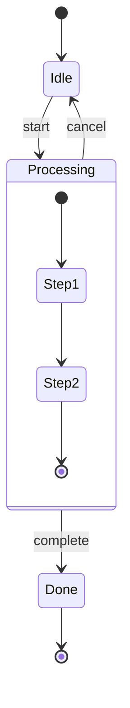

# Mermaid Diagram Editor - 多图表类型重构计划

## 界面设计预览 (ASCII Mockups)

### 1. 主界面布局

```
+-----------------------------------------------------------------------------------+
|  Mermaid Diagram Editor   [Flowchart v]  |  [Select] [Connect]  | [Undo][Redo]   |
+-----------------------------------------------------------------------------------+
|  +-- Toolbar (动态，根据图表类型变化) ------------------------------------+        |
|  | [Rect][Round][Diamond][Circle][...更多形状...]  |  [排版] [TD v]      |        |
|  +------------------------------------------------------------------------+        |
|                                                                                    |
|  +----------------------------------+  +--------------------------------------+    |
|  |                                  |  |  Properties                    [-]  |    |
|  |                                  |  +--------------------------------------+    |
|  |                                  |  |  Label: [___________________]       |    |
|  |           Canvas                 |  |  Type:  [Solid v]                   |    |
|  |         (编辑区域)                |  |  Arrow: [Forward v]                 |    |
|  |                                  |  +--------------------------------------+    |
|  |    +-------+                     |  |  Code                          [Copy]   |
|  |    | Start |                     |  +--------------------------------------+    |
|  |    +---+---+                     |  |  flowchart TD                       |    |
|  |        |                         |  |      A[Start] --> B[Process]        |    |
|  |        v                         |  |      B --> C{Decision}              |    |
|  |    +-------+                     |  |      C -->|Yes| D[End]              |    |
|  |    |Process|                     |  |      C -->|No| B                    |    |
|  |    +---+---+                     |  +--------------------------------------+    |
|  |        |                         |  |  Preview                    [Expand]|    |
|  |        v                         |  +--------------------------------------+    |
|  |    +-------+                     |  |                                     |    |
|  |    /       \                     |  |     +-------+                       |    |
|  |   < Decision >                   |  |     | Start |                       |    |
|  |    \       /                     |  |     +---+---+                       |    |
|  |    +---+---+                     |  |         |                           |    |
|  |   Yes  |  No                     |  |         v                           |    |
|  |    |   +----+                    |  |     (Mermaid Rendered)              |    |
|  |    v        |                    |  |                                     |    |
|  | +-----+     |                    |  +--------------------------------------+    |
|  | | End |<----+                    |  |  [Export: SVG | PNG | PDF]          |    |
|  | +-----+                          |  +--------------------------------------+    |
|  +----------------------------------+                                              |
+------------------------------------------------------------------------------------+
```

### 2. 图表类型选择器

```
+-----------------------------------------------------------------------------------+
|  Mermaid Diagram Editor   [Flowchart    v]  |  [Select] [Connect]  | [Undo][Redo]|
|                           +------------------+                                    |
|                           | * Flowchart      |  <-- 当前选中                      |
|                           |   State Diagram  |                                    |
|                           |   Class Diagram  |                                    |
|                           |   ER Diagram     |                                    |
|                           |   Sequence (TBD) |                                    |
|                           +------------------+                                    |
+-----------------------------------------------------------------------------------+
```

### 3. Flowchart 编辑器 (当前已实现)

```
Toolbar:
+-----------------------------------------------------------------------------+
| [Rect] [Round] [Stadium] [Diamond] [Circle] [Hexagon] [Parallel] [DB] [...] |
| [Flag] [Trapezoid] [TrapezoidAlt] [DoubleCircle] [ParallelAlt]              |
+-----------------------------------------------------------------------------+
|                        | [Auto Layout] | Direction: [TD v] |                |
+-----------------------------------------------------------------------------+

节点形状预览:
  +------+    +------+    +------+    +------+      /\
  | Rect |    ( Round)    ([    ])    (Circle)     /  \
  +------+    +------+    +------+    +------+    < Dia>
                                                   \  /
                                                    \/
  +------+     ____       +--+--+    +------+    +------+
  /      /    /    \      |  |  |    |[    ]|    {{    }}
 /Paral /    ( DB   )     +--+--+    +------+    {{Hex }}
+------+      \____/     Subroutine  Database    {{    }}
```

### 4. State Diagram 编辑器

```
Toolbar:
+-----------------------------------------------------------------------------+
| [State] [Start] [End] [Choice] [Fork] [Join] [Composite] | [Auto Layout]   |
+-----------------------------------------------------------------------------+

Canvas:
+----------------------------------+
|                                  |
|       (*)  <-- Start             |
|        |                         |
|        v                         |
|   +---------+                    |
|   |  Idle   |                    |
|   +---------+                    |
|        |                         |
|        | start                   |
|        v                         |
|   +---------+                    |
|   |Processing                    |
|   |  +-----+  <-- Composite      |
|   |  |Step1|                     |
|   |  +--+--+                     |
|   |     |                        |
|   |  +--v--+                     |
|   |  |Step2|                     |
|   |  +-----+                     |
|   +---------+                    |
|        |                         |
|        | complete                |
|        v                         |
|   +---------+                    |
|   |  Done   |                    |
|   +---------+                    |
|        |                         |
|        v                         |
|       (O)  <-- End               |
|                                  |
+----------------------------------+

Sidebar:
+--------------------------------------+
|  State Properties                    |
+--------------------------------------+
|  Name: [Processing_________]         |
|  Type: [State      v]                |
|        * State                       |
|        * Start (*)                   |
|        * End (O)                     |
|        * Choice <>                   |
|        * Fork ===                    |
|        * Join ===                    |
+--------------------------------------+
|  Description:                        |
|  [_____________________________]     |
|  [_____________________________]     |
+--------------------------------------+
|  [ ] Is Composite State              |
+--------------------------------------+

Transition Properties:
+--------------------------------------+
|  Transition Properties               |
+--------------------------------------+
|  Label:  [start_______________]      |
|  Guard:  [[condition]_________]      |
|  Action: [/ doSomething()_____]      |
+--------------------------------------+
```

### 5. Class Diagram 编辑器

```
Toolbar:
+-----------------------------------------------------------------------------+
| [Class] [Interface] [Abstract] [Enum] | Relationship: [Inherit v] | [Layout]|
+-----------------------------------------------------------------------------+

Canvas:
+----------------------------------+
|                                  |
|   +-------------------------+    |
|   |    <<interface>>        |    |
|   |      IAnimal            |    |
|   +-------------------------+    |
|   | + eat(): void           |    |
|   | + sleep(): void         |    |
|   +------------+------------+    |
|                |                 |
|                | implements      |
|                |                 |
|   +------------v------------+    |
|   |         Dog             |    |
|   +-------------------------+    |
|   | - name: string          |    |
|   | - age: int              |    |
|   +-------------------------+    |
|   | + bark(): void          |    |
|   | + eat(): void           |    |
|   | + sleep(): void         |    |
|   +------------+------------+    |
|                |                 |
|                | has             |
|                | 1..*            |
|   +------------v------------+    |
|   |         Leg             |    |
|   +-------------------------+    |
|   | - length: float         |    |
|   +-------------------------+    |
|   | + walk(): void          |    |
|   +-------------------------+    |
|                                  |
+----------------------------------+

Sidebar - Class Properties:
+--------------------------------------+
|  Class Properties                    |
+--------------------------------------+
|  Name: [Dog___________________]      |
|  Stereotype: [None       v]          |
|              * None                  |
|              * <<interface>>         |
|              * <<abstract>>          |
|              * <<enum>>              |
+--------------------------------------+
|  Attributes:                   [+]   |
+--------------------------------------+
|  [-] name: string              [x]   |
|  [-] age: int                  [x]   |
+--------------------------------------+
|  Methods:                      [+]   |
+--------------------------------------+
|  [+] bark(): void              [x]   |
|  [+] eat(): void               [x]   |
|  [+] sleep(): void             [x]   |
+--------------------------------------+

Member Editor (弹出):
+--------------------------------------+
|  Edit Member                         |
+--------------------------------------+
|  Visibility: [+] Public              |
|              [-] Private             |
|              [#] Protected           |
|              [~] Package             |
+--------------------------------------+
|  Name:       [bark________________]  |
|  Type:       [void________________]  |
|  Parameters: [()__________________]  |
|  [ ] Static                          |
|  [ ] Abstract                        |
+--------------------------------------+
|         [Cancel]  [Save]             |
+--------------------------------------+

Relationship Types:
+--------------------------------------+
|  Relationship: [Inheritance v]       |
|                                      |
|  --------|>  Inheritance             |
|  - - - - |>  Realization             |
|  --------<>  Aggregation             |
|  --------<*> Composition             |
|  --------    Association             |
|  - - - - >   Dependency              |
+--------------------------------------+
|  From Label: [1____]                 |
|  To Label:   [0..*_]                 |
+--------------------------------------+
```

### 6. ER Diagram 编辑器

```
Toolbar:
+-----------------------------------------------------------------------------+
| [Entity] | Relationship: [1:N v] | Cardinality: [||] [|o] [}|] [}o] |[Layout]|
+-----------------------------------------------------------------------------+

Canvas:
+----------------------------------+
|                                  |
|   +-------------+                |
|   |   CUSTOMER  |                |
|   +-------------+                |
|   | * id: INT   |  <-- PK        |
|   | name: VARCHAR                |
|   | email: VARCHAR               |
|   +------+------+                |
|          |                       |
|          | places                |
|          | 1..N                  |
|          |                       |
|   +------v------+                |
|   |    ORDER    |                |
|   +-------------+                |
|   | * id: INT   |                |
|   | # customer_id  <-- FK        |
|   | date: DATE  |                |
|   | total: DECIMAL               |
|   +------+------+                |
|          |                       |
|          | contains              |
|          | 1..N                  |
|          |                       |
|   +------v------+                |
|   | ORDER_ITEM  |                |
|   +-------------+                |
|   | * id: INT   |                |
|   | # order_id  |                |
|   | # product_id|                |
|   | quantity: INT                |
|   +-------------+                |
|                                  |
+----------------------------------+

Sidebar - Entity Properties:
+--------------------------------------+
|  Entity Properties                   |
+--------------------------------------+
|  Name: [ORDER__________________]     |
+--------------------------------------+
|  Attributes:                   [+]   |
+--------------------------------------+
|  [*] id         INT         PK [x]   |
|  [#] customer_id INT        FK [x]   |
|  [ ] date       DATE           [x]   |
|  [ ] total      DECIMAL        [x]   |
+--------------------------------------+

Attribute Editor:
+--------------------------------------+
|  Edit Attribute                      |
+--------------------------------------+
|  Name: [customer_id___________]      |
|  Type: [INT       v]                 |
|        * INT                         |
|        * VARCHAR                     |
|        * DATE                        |
|        * DECIMAL                     |
|        * BOOLEAN                     |
|        * TEXT                        |
+--------------------------------------+
|  [x] Primary Key (PK)                |
|  [x] Foreign Key (FK)                |
|  [ ] Nullable                        |
|  [ ] Unique                          |
+--------------------------------------+

Cardinality Symbols:
+--------------------------------------+
|  ||--------||  One to One            |
|  ||--------}|  One to Many           |
|  }|--------}|  Many to Many          |
|  |o--------|o  Zero or One           |
|  }o--------}o  Zero or Many          |
+--------------------------------------+
```

### 7. 响应式布局 (窄屏)

```
+----------------------------------+
|  Mermaid   [Flowchart v] [Menu] |
+----------------------------------+
| [Rect][Round][...] | [TD v]     |
+----------------------------------+
|                                  |
|           Canvas                 |
|         (全宽显示)                |
|                                  |
|    +-------+                     |
|    | Start |                     |
|    +---+---+                     |
|        |                         |
|        v                         |
|    +-------+                     |
|    |Process|                     |
|    +-------+                     |
|                                  |
+----------------------------------+
|  [Properties] [Code] [Preview]   |  <-- Tab 切换
+----------------------------------+
|  (当前 Tab 内容)                  |
|                                  |
+----------------------------------+
```

### 8. 全屏预览模式

```
+-----------------------------------------------------------------------------------+
|  Preview                                                    [Export v] [X Close]  |
+-----------------------------------------------------------------------------------+
|                                                                                   |
|                                                                                   |
|                          +---------------+                                        |
|                          |    Start      |                                        |
|                          +-------+-------+                                        |
|                                  |                                                |
|                                  v                                                |
|                          +---------------+                                        |
|                          |   Process     |                                        |
|                          +-------+-------+                                        |
|                                  |                                                |
|                                  v                                                |
|                          +-------+-------+                                        |
|                         /               \                                         |
|                        <    Decision     >                                        |
|                         \               /                                         |
|                          +------+------+                                          |
|                            Yes  |  No                                             |
|                             |   +--------+                                        |
|                             v            |                                        |
|                          +-----+         |                                        |
|                          | End |<--------+                                        |
|                          +-----+                                                  |
|                                                                                   |
+-----------------------------------------------------------------------------------+
|  Zoom: [100%]  |  [Fit] [1:1] [+] [-]  |  Drag to pan                            |
+-----------------------------------------------------------------------------------+
```

---

## 项目概述

将现有的 Flowchart 专用编辑器重构为支持多种 Mermaid 图表类型的通用编辑器。

### 目标图表类型（按优先级排序）

| 优先级 | 图表类型 | 复用度 | 工作量 | 说明 |
|-------|---------|-------|-------|------|
| P0 | Flowchart | - | 已完成 | 作为插件重构 |
| P1 | State Diagram | 高 | 中 | 交互模式与流程图相似 |
| P2 | Class Diagram | 中 | 中 | 需要类成员编辑器 |
| P3 | ER Diagram | 中 | 中 | 需要属性编辑器 |
| P4 | Sequence Diagram | 低 | 高 | 交互模式完全不同 |

---

## 目录结构规划

```
src/
├── main.tsx                    # 入口
├── App.tsx                     # 应用根组件（图表类型路由）
│
├── core/                       # 核心框架
│   ├── types.ts               # 核心接口定义
│   ├── registry.ts            # 插件注册中心
│   ├── DiagramContext.tsx     # 图表上下文
│   ├── store.ts               # 全局状态（Zustand）
│   └── hooks/
│       ├── useUndoRedo.ts     # 通用撤销重做
│       ├── useKeyboard.ts     # 通用键盘快捷键
│       └── useDragDrop.ts     # 通用拖拽
│
├── components/                 # 共享组件
│   ├── DiagramEditor.tsx      # 编辑器容器
│   ├── DiagramSelector.tsx    # 图表类型选择器
│   ├── Preview.tsx            # Mermaid 预览（共享）
│   ├── CodeEditor.tsx         # 代码编辑器（共享）
│   ├── ExportMenu.tsx         # 导出菜单（共享）
│   ├── Icons.tsx              # 图标库
│   └── shared/
│       ├── PropertyPanel.tsx  # 属性面板基础组件
│       ├── ColorPicker.tsx
│       └── Tooltip.tsx
│
├── plugins/                    # 图表插件
│   ├── index.ts               # 插件注册入口
│   │
│   ├── flowchart/             # 流程图插件
│   │   ├── index.ts           # 插件定义导出
│   │   ├── types.ts           # 类型定义
│   │   ├── store.ts           # Flowchart 状态
│   │   ├── Toolbar.tsx        # 工具栏
│   │   ├── Canvas.tsx         # 画布
│   │   ├── Sidebar.tsx        # 侧边栏
│   │   ├── NodeVisual.tsx     # 节点渲染
│   │   ├── LinkRenderer.tsx   # 连线渲染
│   │   ├── mermaid.ts         # Mermaid 转换
│   │   ├── layout.ts          # 自动布局
│   │   └── geometry.ts        # 几何计算
│   │
│   ├── state/                  # 状态图插件
│   │   ├── index.ts
│   │   ├── types.ts
│   │   ├── store.ts
│   │   ├── Toolbar.tsx
│   │   ├── Canvas.tsx
│   │   ├── Sidebar.tsx
│   │   ├── StateNode.tsx
│   │   ├── Transition.tsx
│   │   └── mermaid.ts
│   │
│   ├── class/                  # 类图插件
│   │   ├── index.ts
│   │   ├── types.ts
│   │   ├── store.ts
│   │   ├── Toolbar.tsx
│   │   ├── Canvas.tsx
│   │   ├── Sidebar.tsx
│   │   ├── ClassNode.tsx
│   │   ├── MemberEditor.tsx
│   │   ├── Relationship.tsx
│   │   └── mermaid.ts
│   │
│   └── sequence/               # 时序图插件（P4）
│       └── ...
│
└── utils/                      # 工具函数
    ├── export.ts              # 导出功能
    ├── storage.ts             # 本地存储
    └── helpers.ts             # 通用辅助函数
```

---

## 实施阶段

### 阶段一：核心框架搭建（Phase 1）

**目标**：建立插件化架构基础，不破坏现有功能

#### 1.1 核心类型定义 `src/core/types.ts`

```typescript
// 插件接口
export interface DiagramPlugin<TState = unknown> {
  // 元信息
  id: string
  name: string
  icon: React.ReactNode
  description: string

  // 初始状态
  createInitialState: () => TState

  // 组件
  Toolbar: React.ComponentType<ToolbarProps<TState>>
  Canvas: React.ComponentType<CanvasProps<TState>>
  Sidebar: React.ComponentType<SidebarProps<TState>>

  // Mermaid 转换
  toMermaid: (state: TState, direction: DiagramDirection) => string
  fromMermaid: (code: string, existingState?: TState) => ParseResult<TState>

  // 可选功能
  autoLayout?: (state: TState, direction: DiagramDirection) => TState
  validate?: (state: TState) => ValidationError[]
  getDefaultDirection?: () => DiagramDirection
}

// 通用属性接口
export interface ToolbarProps<TState> {
  state: TState
  direction: DiagramDirection
  onStateChange: (state: TState) => void
  onDirectionChange: (dir: DiagramDirection) => void
}

export interface CanvasProps<TState> {
  state: TState
  selection: Selection | null
  view: ViewState
  mode: EditorMode
  onStateChange: (state: TState) => void
  onSelectionChange: (sel: Selection | null) => void
  onViewChange: (view: ViewState) => void
}

export interface SidebarProps<TState> {
  state: TState
  selection: Selection | null
  onStateChange: (state: TState) => void
  onSelectionChange: (sel: Selection | null) => void
}

// 共享类型
export type DiagramDirection = 'TD' | 'LR' | 'BT' | 'RL'
export type EditorMode = 'select' | 'connect'

export interface Selection {
  type: string
  ids: string[]
}

export interface ViewState {
  x: number
  y: number
  scale: number
}

export interface ParseResult<T> {
  success: boolean
  state?: T
  direction?: DiagramDirection
  errors?: string[]
}
```

#### 1.2 插件注册中心 `src/core/registry.ts`

```typescript
import { DiagramPlugin } from './types'

class PluginRegistry {
  private plugins = new Map<string, DiagramPlugin>()
  private defaultPluginId: string | null = null

  register(plugin: DiagramPlugin, isDefault = false) {
    this.plugins.set(plugin.id, plugin)
    if (isDefault || this.defaultPluginId === null) {
      this.defaultPluginId = plugin.id
    }
  }

  get(id: string): DiagramPlugin | undefined {
    return this.plugins.get(id)
  }

  getDefault(): DiagramPlugin | undefined {
    return this.defaultPluginId ? this.plugins.get(this.defaultPluginId) : undefined
  }

  getAll(): DiagramPlugin[] {
    return Array.from(this.plugins.values())
  }

  getIds(): string[] {
    return Array.from(this.plugins.keys())
  }
}

export const pluginRegistry = new PluginRegistry()
```

#### 1.3 全局状态管理 `src/core/store.ts`

```typescript
import { create } from 'zustand'
import { DiagramDirection, EditorMode, Selection, ViewState } from './types'

interface EditorStore {
  // 当前图表类型
  activePluginId: string
  setActivePlugin: (id: string) => void

  // 图表状态（每个插件独立存储）
  diagramStates: Record<string, unknown>
  setDiagramState: (pluginId: string, state: unknown) => void
  getDiagramState: <T>(pluginId: string) => T | undefined

  // 编辑器状态
  direction: DiagramDirection
  setDirection: (dir: DiagramDirection) => void

  mode: EditorMode
  setMode: (mode: EditorMode) => void

  selection: Selection | null
  setSelection: (sel: Selection | null) => void

  view: ViewState
  setView: (view: ViewState) => void

  // 代码编辑
  generatedCode: string
  setGeneratedCode: (code: string) => void
  isManualEditing: boolean
  setIsManualEditing: (val: boolean) => void

  // UI 状态
  isPreviewFullscreen: boolean
  togglePreviewFullscreen: () => void
}

export const useEditorStore = create<EditorStore>((set, get) => ({
  activePluginId: 'flowchart',
  setActivePlugin: (id) => set({ activePluginId: id, selection: null }),

  diagramStates: {},
  setDiagramState: (pluginId, state) => set((s) => ({
    diagramStates: { ...s.diagramStates, [pluginId]: state }
  })),
  getDiagramState: <T>(pluginId: string) => get().diagramStates[pluginId] as T | undefined,

  direction: 'TD',
  setDirection: (direction) => set({ direction }),

  mode: 'select',
  setMode: (mode) => set({ mode }),

  selection: null,
  setSelection: (selection) => set({ selection }),

  view: { x: 0, y: 0, scale: 1 },
  setView: (view) => set({ view }),

  generatedCode: '',
  setGeneratedCode: (generatedCode) => set({ generatedCode }),
  isManualEditing: false,
  setIsManualEditing: (isManualEditing) => set({ isManualEditing }),

  isPreviewFullscreen: false,
  togglePreviewFullscreen: () => set((s) => ({ isPreviewFullscreen: !s.isPreviewFullscreen })),
}))
```

#### 1.4 任务清单

- [ ] 创建 `src/core/` 目录结构
- [ ] 实现 `types.ts` 核心接口
- [ ] 实现 `registry.ts` 插件注册
- [ ] 实现 `store.ts` Zustand 状态管理
- [ ] 创建 `DiagramContext.tsx` 上下文提供者

---

### 阶段二：Flowchart 插件化重构（Phase 2）

**目标**：将现有 Flowchart 代码重构为插件格式

#### 2.1 文件迁移映射

| 原文件 | 新位置 |
|-------|--------|
| `types/index.ts` (Flowchart部分) | `plugins/flowchart/types.ts` |
| `components/Header.tsx` (节点按钮) | `plugins/flowchart/Toolbar.tsx` |
| `components/Canvas.tsx` | `plugins/flowchart/Canvas.tsx` |
| `components/NodeVisual.tsx` | `plugins/flowchart/NodeVisual.tsx` |
| `components/LinkRenderer.tsx` | `plugins/flowchart/LinkRenderer.tsx` |
| `components/Sidebar.tsx` (属性部分) | `plugins/flowchart/Sidebar.tsx` |
| `utils/mermaid.ts` | `plugins/flowchart/mermaid.ts` |
| `utils/geometry.ts` | `plugins/flowchart/geometry.ts` |
| `utils/layout.ts` | `plugins/flowchart/layout.ts` |
| `utils/nodeSize.ts` | `plugins/flowchart/nodeSize.ts` |

#### 2.2 插件定义 `plugins/flowchart/index.ts`

```typescript
import { DiagramPlugin } from '@/core/types'
import { FlowchartState, createInitialState } from './types'
import { FlowchartToolbar } from './Toolbar'
import { FlowchartCanvas } from './Canvas'
import { FlowchartSidebar } from './Sidebar'
import { toMermaid, fromMermaid } from './mermaid'
import { applyAutoLayout } from './layout'
import { Icons } from '@/components/Icons'

export const flowchartPlugin: DiagramPlugin<FlowchartState> = {
  id: 'flowchart',
  name: '流程图',
  icon: Icons.Flowchart,
  description: '创建流程图、决策树等',

  createInitialState,

  Toolbar: FlowchartToolbar,
  Canvas: FlowchartCanvas,
  Sidebar: FlowchartSidebar,

  toMermaid,
  fromMermaid,
  autoLayout: applyAutoLayout,
  getDefaultDirection: () => 'TD',
}
```

#### 2.3 任务清单

- [ ] 创建 `plugins/flowchart/` 目录
- [ ] 迁移并调整 `types.ts`
- [ ] 迁移并调整 `mermaid.ts`
- [ ] 迁移并调整 `geometry.ts`, `layout.ts`, `nodeSize.ts`
- [ ] 重构 `Toolbar.tsx`（从 Header 提取）
- [ ] 重构 `Canvas.tsx`（适配新接口）
- [ ] 重构 `Sidebar.tsx`（提取属性编辑部分）
- [ ] 迁移 `NodeVisual.tsx`, `LinkRenderer.tsx`
- [ ] 创建插件入口 `index.ts`
- [ ] 验证功能完整性

---

### 阶段三：共享组件重构（Phase 3）

**目标**：提取可复用的共享组件

#### 3.1 共享组件列表

| 组件 | 说明 |
|-----|------|
| `DiagramEditor.tsx` | 编辑器主容器，加载当前插件的 Toolbar/Canvas/Sidebar |
| `DiagramSelector.tsx` | 图表类型切换下拉菜单 |
| `Preview.tsx` | Mermaid 预览面板 |
| `CodeEditor.tsx` | 代码编辑区 |
| `ExportMenu.tsx` | 导出菜单（SVG/PNG/PDF） |
| `Header.tsx` | 精简后的顶部栏（Logo + 通用按钮） |

#### 3.2 新 App.tsx 结构

```tsx
export default function App() {
  const { activePluginId } = useEditorStore()
  const plugin = pluginRegistry.get(activePluginId)

  if (!plugin) return <div>Loading...</div>

  return (
    <div className="flex flex-col h-screen">
      <Header />
      <div className="flex flex-1 overflow-hidden">
        <DiagramEditor plugin={plugin} />
        <RightPanel plugin={plugin} />
      </div>
    </div>
  )
}

function DiagramEditor({ plugin }: { plugin: DiagramPlugin }) {
  return (
    <div className="flex-1 flex flex-col">
      <plugin.Toolbar {...toolbarProps} />
      <plugin.Canvas {...canvasProps} />
    </div>
  )
}

function RightPanel({ plugin }: { plugin: DiagramPlugin }) {
  return (
    <div className="w-80 flex flex-col">
      <plugin.Sidebar {...sidebarProps} />
      <CodeEditor />
      <Preview />
    </div>
  )
}
```

#### 3.3 任务清单

- [ ] 创建 `DiagramEditor.tsx`
- [ ] 创建 `DiagramSelector.tsx`
- [ ] 提取 `Preview.tsx`（从 Sidebar）
- [ ] 提取 `CodeEditor.tsx`（从 Sidebar）
- [ ] 提取 `ExportMenu.tsx`
- [ ] 重构 `Header.tsx`（移除节点按钮，添加类型选择器）
- [ ] 重构 `App.tsx`
- [ ] 验证 Flowchart 功能正常

---

### 阶段四：State Diagram 插件（Phase 4）

**目标**：实现状态图插件，验证插件架构

#### 4.1 State Diagram 特性

```typescript
// plugins/state/types.ts
export interface StateDiagramState {
  states: StateNode[]
  transitions: Transition[]
}

export interface StateNode {
  id: string
  name: string
  type: 'state' | 'start' | 'end' | 'choice' | 'fork' | 'join'
  x: number
  y: number
  description?: string
  // 复合状态
  isComposite?: boolean
  substates?: StateNode[]
}

export interface Transition {
  id: string
  from: string
  to: string
  label?: string      // 触发事件
  guard?: string      // [条件]
  action?: string     // / 动作
}
```

#### 4.2 Mermaid 语法支持



#### 4.3 与 Flowchart 的复用

| 组件 | 复用策略 |
|-----|---------|
| Canvas 拖拽逻辑 | 可复用，提取为 hook |
| 节点渲染 | 需要新的状态节点组件 |
| 连线渲染 | 可复用 LinkRenderer |
| 布局算法 | 可复用 dagre |
| 几何计算 | 部分复用 |

#### 4.4 任务清单

- [ ] 创建 `plugins/state/` 目录
- [ ] 实现 `types.ts`
- [ ] 实现 `StateNode.tsx` 状态节点渲染
- [ ] 实现 `Transition.tsx` 转换线渲染
- [ ] 实现 `Toolbar.tsx`
- [ ] 实现 `Canvas.tsx`（复用拖拽逻辑）
- [ ] 实现 `Sidebar.tsx`
- [ ] 实现 `mermaid.ts` 生成/解析
- [ ] 实现 `layout.ts` 自动布局
- [ ] 注册插件并测试

---

### 阶段五：Class Diagram 插件（Phase 5）

**目标**：实现类图插件

#### 5.1 Class Diagram 特性

```typescript
// plugins/class/types.ts
export interface ClassDiagramState {
  classes: ClassNode[]
  relationships: Relationship[]
}

export interface ClassNode {
  id: string
  name: string
  x: number
  y: number
  stereotype?: '<<interface>>' | '<<abstract>>' | '<<enum>>'
  attributes: ClassMember[]
  methods: ClassMember[]
}

export interface ClassMember {
  id: string
  visibility: '+' | '-' | '#' | '~'
  name: string
  type?: string
  parameters?: string  // for methods
  isStatic?: boolean
  isAbstract?: boolean
}

export interface Relationship {
  id: string
  from: string
  to: string
  type: 'inheritance' | 'realization' | 'composition' |
        'aggregation' | 'association' | 'dependency'
  fromCardinality?: string
  toCardinality?: string
  label?: string
}
```

#### 5.2 特殊交互需求

- 类框内成员列表编辑
- 双击成员进入编辑模式
- 成员拖拽排序
- 关系线端点不同形状

#### 5.3 任务清单

- [ ] 创建 `plugins/class/` 目录
- [ ] 实现 `types.ts`
- [ ] 实现 `ClassNode.tsx` 类节点渲染（含成员）
- [ ] 实现 `MemberEditor.tsx` 成员编辑器
- [ ] 实现 `Relationship.tsx` 关系线渲染
- [ ] 实现 `Toolbar.tsx`
- [ ] 实现 `Canvas.tsx`
- [ ] 实现 `Sidebar.tsx`
- [ ] 实现 `mermaid.ts`
- [ ] 注册插件并测试

---

### 阶段六：ER Diagram 插件（Phase 6）

#### 6.1 ER Diagram 特性

```typescript
export interface ERDiagramState {
  entities: Entity[]
  relationships: ERRelationship[]
}

export interface Entity {
  id: string
  name: string
  x: number
  y: number
  attributes: EntityAttribute[]
}

export interface EntityAttribute {
  id: string
  name: string
  type: string
  isPK?: boolean
  isFK?: boolean
  isNullable?: boolean
  isUnique?: boolean
}

export interface ERRelationship {
  id: string
  from: string
  to: string
  fromCardinality: '||' | '|o' | '}|' | '}o'  // one, zero-one, many, zero-many
  toCardinality: '||' | '|o' | '}|' | '}o'
  label?: string
  identifying?: boolean
}
```

#### 6.2 任务清单

- [ ] 创建 `plugins/er/` 目录
- [ ] 实现所有组件
- [ ] 实现 Mermaid 转换
- [ ] 注册并测试

---

## 里程碑计划

| 里程碑 | 内容 | 预期成果 |
|-------|------|---------|
| M1 | Phase 1-2 | 核心框架 + Flowchart 插件化 |
| M2 | Phase 3 | 共享组件完成，可切换图表类型（仅 Flowchart） |
| M3 | Phase 4 | State Diagram 可用 |
| M4 | Phase 5 | Class Diagram 可用 |
| M5 | Phase 6 | ER Diagram 可用 |

---

## 验收标准

### 功能验收
- [ ] Flowchart 所有现有功能正常
- [ ] 可通过 UI 切换图表类型
- [ ] 每种图表类型可独立编辑、预览、导出
- [ ] Mermaid 代码双向同步正常
- [ ] 撤销/重做功能正常
- [ ] 本地存储正常（按图表类型分开存储）

### 代码质量
- [ ] TypeScript 类型完整
- [ ] 无 any 类型滥用
- [ ] 插件接口清晰
- [ ] 组件职责单一

---

## 开始实施

准备好后，请确认是否开始 **Phase 1: 核心框架搭建**？
